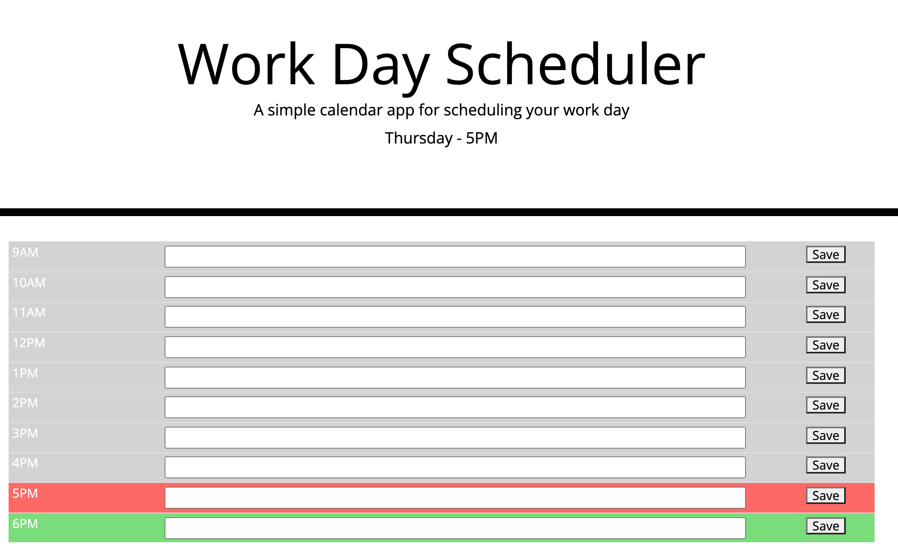

# Homework-5---Day-Planner-MLL

This project was to take an HTML template, and using JS, JQuery, and Bootstrap, create a day planner which will save tasks even when the browser is refreshed. The color of the time rows reflects the current, past, and future times.

## Functionality
The user is presented with the current day and hour in the header when the page loads.

Each time column features a text input, which the user can save to local storage by clicking the corresponding Save button.

When the page is loaded or refreshed, the saved items will present themselves automatically from the last session.

The past time rows appears in grey, the future times appear in green, and the present time appears in red.

## Potential Future Features
The developer hopes to add the functionality of updating the header time and day, as well as the row colors, as soon as the hour turns. Attempts to do this can be found in the [app.js](./assets/js/app.js) file as code that has been commented out. One issue this presents is that the colors take a second to load after the page is loaded.

The developer also hopes to add a Clear button for each row, so the user does not have to manually delete the text input in order to clear that hour out.

The application can be accessed online [here](https://mat-lundin.github.io/Homework-5---Day-Planner-MLL/).

